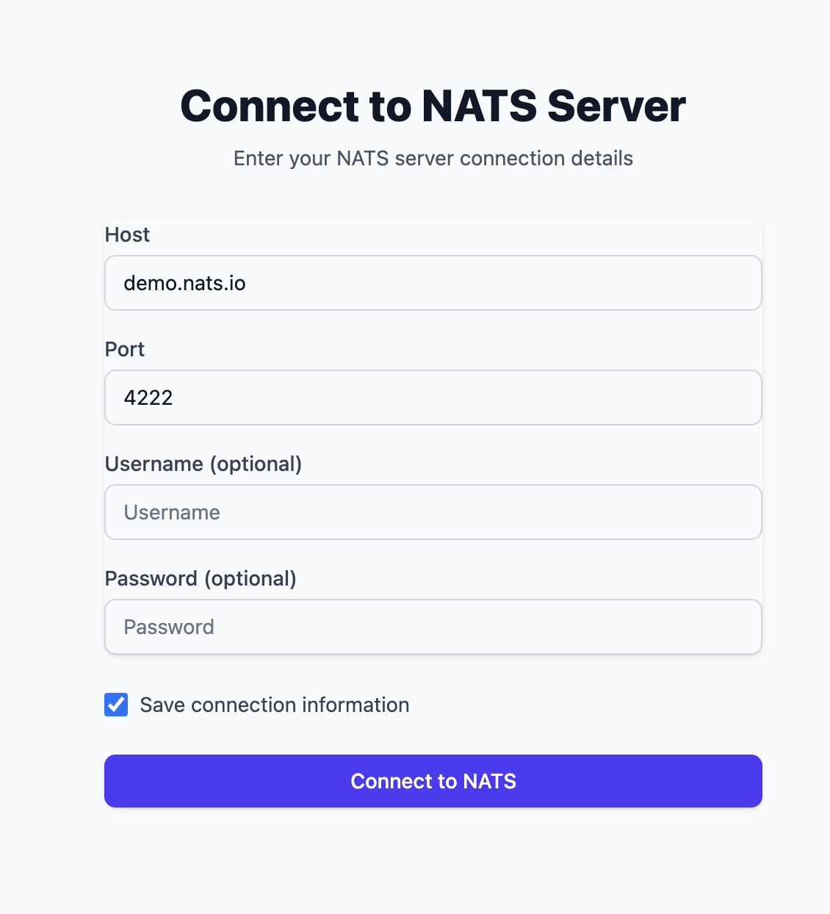
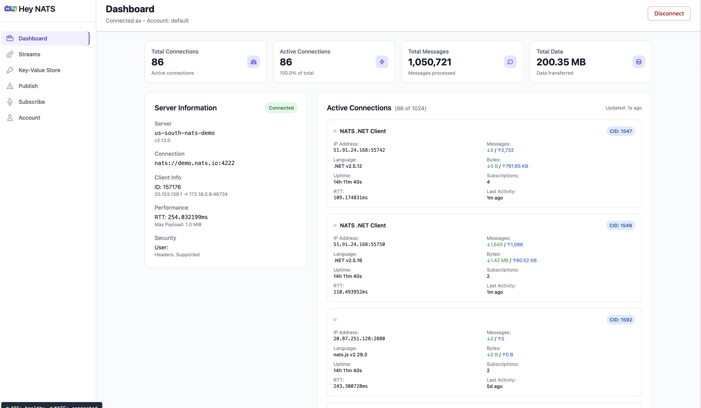

# HeyNATS 🚀

<div align="center">


**A modern, web-based administration interface for NATS Server**

[](https://reactjs.org/)
[](https://golang.org/)
[](https://www.typescriptlang.org/)
[](LICENSE.md)

[Demo](#-demo) •
[Features](#-features) •
[Quick Start](#-quick-start) •
[Installation](#-installation) •
[Documentation](#-documentation) •
[Contributing](#-contributing)

</div>

---

## 📖 What is HeyNATS?

HeyNATS is a modern, intuitive web-based administration interface for [NATS Server](https://nats.io/). It provides a user-friendly dashboard to manage NATS connections, streams, consumers, and key-value stores without needing command-line expertise.

Think of it as "phpMyAdmin for NATS" - making NATS server management accessible through a beautiful, responsive web interface.

## 🎮 Demo

Experience HeyNATS without any setup! Try our live demo using the public NATS server:

### 🌐 Quick Demo Setup

**Connection Details:**
```
Host: demo.nats.io
Port: 4222
Authentication: None required
```

### 📱 Demo Screenshots

<div align="center">

**Login Screen**


**Dashboard Overview**


</div>

> **💡 Tip**: The demo server is public, so you might see data from other users. This is normal and demonstrates HeyNATS's real-time capabilities!

## ✨ Features

### 🔌 **Connection Management**
- Connect to multiple NATS servers simultaneously
- Support for authentication (user/password, token, JWT)
- Real-time connection status monitoring
- Connection pooling and management

### 📊 **JetStream Administration**
- **Stream Management**: Create, view, edit, and delete streams
- **Consumer Management**: Monitor and manage stream consumers
- **Message Publishing**: Send messages to streams and subjects
- **Message Consumption**: Subscribe to streams and view real-time messages

### 🗄️ **Key-Value Store Operations**
- Create and manage KV buckets
- Browse, add, edit, and delete key-value pairs
- Real-time KV operations monitoring
- Bucket configuration management

### 📈 **Monitoring & Analytics**
- Real-time server statistics and metrics
- Stream and consumer performance monitoring
- Message flow visualization
- Connection health dashboards

### 🎨 **Modern UI/UX**
- Responsive design that works on desktop, tablet, and mobile
- Dark/light theme support
- Intuitive navigation and user experience
- Real-time updates without page refresh

## 🛠️ Tech Stack

### Frontend
- **React 19** - Modern React with latest features
- **TypeScript** - Type-safe development
- **React Router v7** - Advanced routing with loaders
- **TanStack Query** - Server state management and caching
- **TailwindCSS 4** - Utility-first styling
- **Vite** - Lightning-fast build tool
- **shadcn/ui** - Beautiful, accessible component library

### Backend
- **Go 1.24.0+** - High-performance backend
- **Gin Framework** - Fast HTTP web framework
- **NATS Go Client** - Official NATS client library
- **Graceful Shutdown** - Proper resource cleanup

## 🏗️ Project Structure

```
heynats/
├── main.go                 # Go server entry point
├── internal/              # Backend Go modules
│   ├── api/              # API handlers (NATS, KV, Streams)
│   ├── infrastructure/   # Router and middleware
│   ├── model/           # Data models
│   └── pkg/             # NATS client package
├── client/               # React frontend application
│   ├── src/
│   │   ├── components/  # Reusable UI components
│   │   ├── pages/       # Page components
│   │   ├── hooks/       # Custom React hooks
│   │   ├── lib/         # Utilities and API client
│   │   └── providers/   # Context providers
│   ├── dist/            # Built frontend (served by Gin)
│   └── package.json
├── docs/                # Documentation
├── Makefile             # Build automation
├── build-and-run.sh     # Quick start script
├── dev.sh              # Development mode script
└── docker-compose.yml  # Docker setup
```

## 🚀 Quick Start

### Option 1: Try the Demo First! 🎮
No installation needed - just try HeyNATS with our [demo setup](#-demo) using `demo.nats.io`.

### Option 2: Install Locally
The fastest way to get HeyNATS running on your machine:

```bash
# Clone the repository
git clone https://github.com/Astergaze-Solutions/heynats.git
cd heynats

# Quick build and run (recommended for first-time users)
./build-and-run.sh

# Open your browser to http://localhost:5000
```

That's it! HeyNATS will be running and ready to connect to your NATS server.

## 💻 Installation

### Prerequisites

#### System Requirements
- **Go 1.24.0 or later** - [Download Go](https://golang.org/dl/)
- **Node.js 18+ and pnpm** - [Install Node.js](https://nodejs.org/) and [Install pnpm](https://pnpm.io/installation)
- **NATS Server** - [Install NATS Server](https://docs.nats.io/running-a-nats-service/introduction/installation)

```bash
# Install pnpm globally
npm install -g pnpm

# Verify installations
go version    # Should be 1.24.0+
node --version # Should be 18+
pnpm --version
```

### Full Installation

1. **Clone the repository**
   ```bash
   git clone https://github.com/Astergaze-Solutions/heynats.git
   cd heynats
   ```

2. **Install dependencies**
   ```bash
   # Install all dependencies (Go + Node.js)
   make install
   
   # Or manually:
   go mod tidy
   cd client && pnpm install && cd ..
   ```

3. **Setup development tools** (Optional but recommended)
   ```bash
   # Install lefthook for Git hooks
   go install github.com/evilmartians/lefthook@latest
   lefthook install
   
   # Install Go development tools
   go install golang.org/x/tools/cmd/goimports@latest
   go install github.com/air-verse/air@latest  # For hot reload
   ```

## 🎯 Usage

### Starting HeyNATS

#### Option 1: Production Build (Recommended)
```bash
# Build and run in one command
./build-and-run.sh

# Or using Makefile
make run
```

#### Option 2: Development Mode (Hot Reload)
```bash
# Start both frontend and backend with hot reload
./dev.sh

# Or using Makefile
make dev-full
```

### Connecting to NATS Server

1. **Access HeyNATS**: Open http://localhost:5000 in your browser

2. **Create a Connection**: Click "New Connection" and configure:

   **For Demo/Testing:**
   - **Server URL**: `nats://demo.nats.io:4222`
   - **Name**: "Demo Server" (or any friendly name)
   - **Authentication**: Leave blank (no auth required)

   **For Local Development:**
   - **Server URL**: `nats://localhost:4222` (default local NATS server)
   - **Name**: "Local NATS" (or any friendly name)
   - **Authentication**: Configure if your NATS server requires auth

3. **Start Managing**: Once connected, you can:
   - Create and manage JetStream streams
   - Publish and subscribe to messages
   - Manage Key-Value stores
   - Monitor server statistics

### Available URLs
- **Web Interface**: http://localhost:5000
- **API Endpoints**: http://localhost:5000/api/*
- **React Dev Server** (dev mode): http://localhost:5173

## 🔧 Development

### Available Commands

```bash
# Development
make dev-full        # Start both frontend and backend with hot reload
make dev            # Start only React dev server
./dev.sh            # Alternative script for development mode

# Production
make run            # Build and run production version
./build-and-run.sh  # Quick production build script

# Building
make build          # Build both frontend and backend
make build-client   # Build only React frontend

# Utilities
make install        # Install all dependencies
make clean          # Clean build artifacts
make help          # Show all available commands
```

### Development Architecture

- **Frontend**: React dev server runs on `:5173` with hot reload and proxies API calls to `:5000`
- **Backend**: Go server runs on `:5000` serving both API endpoints and static files
- **Live Reload**: Frontend changes reflect immediately, backend changes require restart (use `air` for hot reload)

## 🐳 Docker Support

Run HeyNATS with Docker Compose:

```bash
# Start HeyNATS with NATS server
docker-compose up -d

# Access at http://localhost:5000
# NATS server available at nats://localhost:4222
```

## 📚 Documentation

- [Architecture Overview](docs/ARCHITECTURE.md) - Detailed technical architecture
- [Connection Management](docs/CONNECTION_MANAGEMENT.md) - NATS connection handling
- [Frontend Integration](docs/FRONTEND_INTEGRATION.md) - React and API integration
- [UI Improvements](docs/UI_IMPROVEMENTS.md) - UI/UX design decisions

## 🧪 Testing

```bash
# Run Go tests
go test ./...

# Run frontend tests
cd client && pnpm test

# Run linting
make lint           # Lint both Go and TypeScript
cd client && pnpm lint  # Frontend only
```

## 🤝 Contributing

We welcome contributions! Please read our [Contributing Guidelines](CONTRIBUTING.md) for detailed information on:

- 🐛 Reporting bugs
- 💡 Suggesting features  
- 💻 Code contributions
- 📝 Documentation improvements
- 🔧 Development setup

**Quick start for contributors:**

1. Fork the repository
2. Create a feature branch: `git checkout -b feature/amazing-feature`
3. Commit your changes: `git commit -m 'Add amazing feature'`
4. Push to the branch: `git push origin feature/amazing-feature`
5. Open a Pull Request

### Development Setup for Contributors

```bash
# Clone your fork
git clone https://github.com/your-username/heynats.git
cd heynats

# Install dependencies
make install

# Setup pre-commit hooks
lefthook install

# Start development
make dev-full
```

## 📄 License

This project is licensed under the MIT License - see the [LICENSE.md](LICENSE.md) file for details.

## 👩‍💻 Contributors

We're grateful to all the amazing people who have contributed to HeyNATS! 🎉

<!-- Contributors list will be automatically updated -->
<a href="https://github.com/astergaze-solutions/heynats/graphs/contributors">
  
</a>

Made with [contrib.rocks](https://contrib.rocks).

### How to Contribute

Want to see your profile here? We'd love your contributions! Check out our [Contributing Guidelines](CONTRIBUTING.md) to get started.

### Core Maintainers

- **[@mukezhz](https://github.com/mukezhz)** - Project Lead & Core Developer
- **[@Astergaze-Solutions](https://github.com/Astergaze-Solutions)** - Organization & Project Sponsor

*Interested in becoming a maintainer? Contribute regularly and reach out to us!*

## 🙏 Acknowledgments

- **NATS.io** - For the amazing NATS messaging system
- **Adminer** - UI/UX inspiration for database administration tools
- **shadcn/ui** - Beautiful component library
- **TailwindCSS** - Utility-first CSS framework

## 📞 Support

- **Issues**: [GitHub Issues](https://github.com/Astergaze-Solutions/heynats/issues)
- **Documentation**: [docs/](docs/)
- **NATS Community**: [NATS Slack](https://nats.io/community/)

---

<div align="center">
  <p>Made with ❤️ by the <a href="https://astergaze.com">Astergaze Solutions</a> team</p>
  <p>⭐ Star this project if you find it helpful!</p>
</div>
